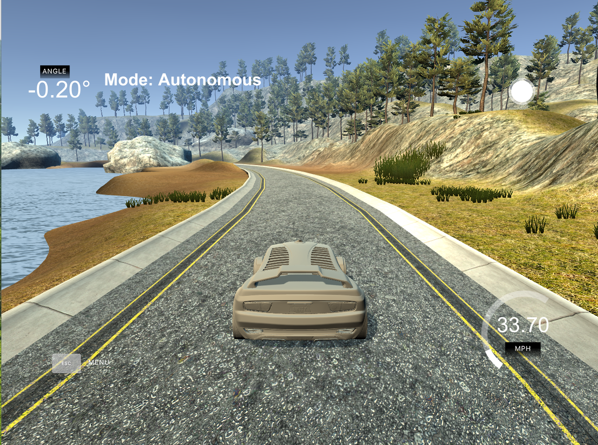
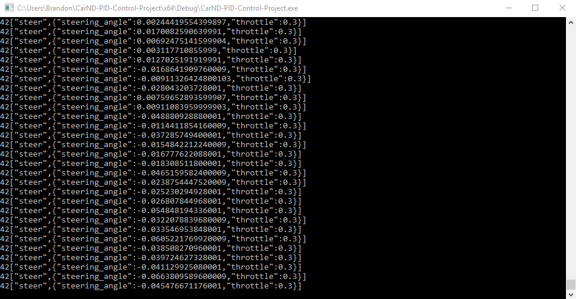

# **PID Controller** 

**PID Controller Project**

The goals / steps of this project are the following:
* Build a Proportional-Integral-Derivative (PID) controller
* Test the PID controller solution on the simulator
* Tune the PID hyperparameters    
* Test that the solution can successfully drive the around track once without leaving the road
* Summarize the results with a written report
  * Describe the effect each of the P, I, D components had on the implementation
  * Describe how the final hyperparameters were chosen 

---
### Overview

The C++ project solution is a PID controller that controls a vehicle within the Udacity simulator.    The starting code provided by Udacity can be found [here](https://github.com/udacity/CarND-PID-Control-Project).  The [Udacity simulator](https://github.com/udacity/self-driving-car-sim/releases) provides the following data via WebSocket:

- Cross-track error (CTE) - *The distance of the vehicle from the center of the lane* (main.cpp line 75)
- Speed - *Miles per hour* (main.cpp line 76)
- Steering angle - *In degrees* (main.cpp line 77)

The C++ PID controller solution receives the elements described above from the simulator and then calculates a steering angle (main.cpp lines 85-88).  It returns a steering value [-1, 1] to the simulator (main.cpp lines 95-100).  The simulator can also accept a throttle value [-1, 1] in the return message.  I set the throttle value to 0.3 (main.cpp line 96).

Sample console output of messages returned to the simulator is below.  Each message includes steering and throttle values.

#### P,I,D Components

The PID controller is initialized with three values: Kp, Ki, and Kd (main.cpp lines 39-54).  These values drive the steering angle calculation and can be passed to the console app via command line arguments.  Default values are used if no command line arguments are provided.

The three terms and their effects are defined below.  They are used in the steering value calculation located in PID.cpp lines 66-71.

| Term | Description                                                  |
| ---- | ------------------------------------------------------------ |
| Kp   | The "proportional" term controls how far to steer for a given CTE value.    Low Kp values cause sluggish steering.  The higher the Kp value the larger the steering value will be for a given CTE; however if the Kp value is too high the steering will "overshoot" by a large amount causing the vehicle's steering to oscillate. |
| Ki   | The "integral" term accounts for the sum of the error CTE over time (i.e., steady state error or bias).  The term should be used to slowly adjust steering for accumulated CTE. |
| Kd   | The "derivative" term accounts for the rate of change in the CTE.    The Kd term softens turning for hard steering commands. It reduces the overshooting of the Kp term thereby reducing the oscillation, or sway. |

#### Kp,Ki,Kd Tuning

I started with large Kp values and set the other terms to zero.  I eventually arrived at a Kp value of 0.12 which made the vehicle drive ok for a short while.  An example of the simulator with term values [Kp=0.12, Ki= 0, Kd=0] is below.  The vehicle starts off ok, but soon begins to overshoot until it runs off the road.

I then adjusted the Kd term to soften the Kp steering values and reduce overshoot/oscillation.  I eventually arrived at a Kd value of 1.83.  The vehicle was then able to make it around the track; however, it tended to cross over the left and right yellow lane lines at turns.  Therefore I increased the Kp value until I reached 0.15.  I did not need to set the Ki value for the vehicle to make it around the track.  

An example of the simulator with term values [Kp=0.15, Ki=0, Kd=1.83] is below.

****